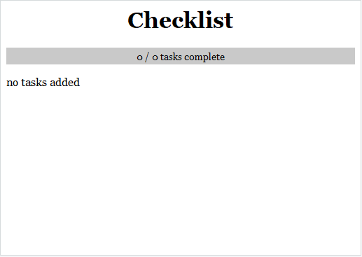

<!-- README.md is generated from README.Rmd. Please edit that file -->

```{r setup, include = FALSE}
knitr::opts_chunk$set(
  eval = FALSE,
  collapse = TRUE,
  comment = "#>",
  fig.path = "man/figures/",
  out.width = "100%"
)
```
# checklist

This package provides functionality for creating, updating, and viewing checklists directly within RStudio. Checklists are built as temporary HTML files and opened up in RStudio's Viewer pane. Functionality and design is intended to be relatively minimal, but I'd love to continue adding more to this package as time and interest permits. 

<br>

## Installation

Install via devtools:

``` {r install}
devtools::install_github("geoffwlamb/checklist")
```

<br>

## Quick Start Guide
This guide intends to expose you to the most basic functionality of the checklist package. Essentially, this will cover what the functions are trying to do, but not explore their full capabilities. Please refer to function documentation for more specific usage. 

Let's get started!

``` {r library}
library(checklist)
```

<br>

### Create a Checklist
A skeleton of your checklist can be made by calling <strong>cl_create</strong>:
``` {r cl_create}
my_checklist <- cl_create()
```
The checklist should appear in the Viewer pane of RStudio and look something like this:




Note that the color scheme will blend in with your current RStudio theme. The checklist color scheme can be changed by specifying arguments inside your call to cl_create or afterwards via cl_set (covered below).

<br>

### Adding and Editing Content
Now that you have a checklist, let's start making it a bit more useful by adding items. Items can be added like so:
``` {r cl_add}
cl_add(my_checklist, text = c("item 1", "item 2", "item 3", "etc."))
```


<br>

If you need to adjust the text of an item, you can do so by using <strong>cl_edit</strong>:

``` {r cl_edit} 
cl_edit(my_checklist, at_items = 4, text = "item 4")
```


<br>

Items can be removed the same fashion by using the <strong>cl_remove</strong> function.

<br>

### Completing Tasks
The most satisfying part of any checklist is actually checking items off. Although HTML supports interactive checkboxes, I'm not sure of a convenient method for capturing and preserving interactivity from RStudio's Viewer pane. Instead, items can be completed via the command line using <strong>cl_complete</strong>:
``` {r cl_complete}
cl_complete(my_checklist, at_items = 1)
```


<br>

You can undo the completion of items by using <strong>cl_uncomplete</strong>.

<br>

### Customizing a Checklist
If you want to change the appearance of your checklist or change any other settings, you can do so via <strong>cl_set</strong>. Please refer to the help documentation for cl_set if you're interested in exploring options.
``` {r cl_set}
cl_set(
  cl = my_checklist, 
  title = "My Checklist", 
  background.color = "darkblue", 
  text.color = "lightgray", 
  font.family = "arial"
)
```


<br>

If you've changed the global theme in RStudio or just want to revert the style of your checklist back to its default, a convenience function, <strong>cl_blend</strong> is available as well.

<br>

### Saving and Loading
Checklist objects can be saved and reloaded as .rds files. Two functions are available for saving and loading your checklist in an expected manner.
``` {r save and load}
cl_save(my_checklist, "my_checklist.rds")

cl_load("my_checklist.rds")
```
